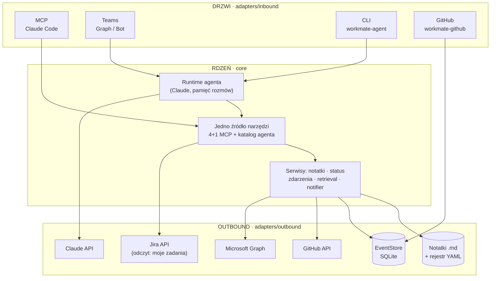

# WorkMate

[](https://www.python.org/)
[](https://github.com/BIAP-Inteligentne-Technologie/PIWorkmate/actions/workflows/ci.yml)
[](CHANGELOG.md)
[](LICENSE)

**Wewnętrzny serwer MCP i runtime agenta pionu Inteligentnych Technologii BIAP** — wspólna baza
wiedzy o projektach, dostępna tam, gdzie zespół już pracuje: w Claude Code, na Teams i w GitHubie.

> **Status: produkcyjny — kod Fazy 1–4 domknięty.** Serwer MCP, runtime agenta w rdzeniu, drzwi
> Teams/CLI/GitHub, most GitHub ↔ EventStore ↔ Teams (z bramkowanym zapisem), odczyt Jira „moje
> zadania" oraz lokalny retrieval leksykalny notatek. Karty czasu (WorklogPRO) wycofane z projektu
> (2026-07-30, [ADR 0055](docs/adr/0055-withdraw-worklogpro-timesheets.md)). 65 ADR-ów
> architektonicznych (`docs/adr/`; dwa najnowsze — 0064/0065, harness plików + baza mutowalna —
> w statusie `proposed`, poza kodem produkcyjnym), pełny zestaw testów zielony. Meta Fazy 1 (wdrożenie HTTP na
> serwerze firmowym) wciąż otwarta — patrz [`docs/roadmap-v1-gap-analysis.md`](docs/roadmap-v1-gap-analysis.md).

## O projekcie

WorkMate realizuje zasadę **„jeden rdzeń, wiele drzwi"**: cała logika i cała wartość mieszkają
w jednym, niezależnym od interfejsu rdzeniu (`core/`), a każdy kanał dostępu — Claude Code przez
MCP, Teams, CLI, GitHub — jest cienkim adapterem nad tym samym katalogiem narzędzi. Dzięki temu
nowa zdolność (narzędzie, drzwi, integracja) powstaje raz i jest dostępna wszędzie, zamiast być
duplikowana per kanał.

Wartość dla zespołu: notatki ze spotkań i status projektów trafiają do jednej, przeszukiwalnej
bazy zamiast rozproszonych plików; GitHub i Teams rozmawiają ze sobą (nowe issue, PR, wynik CI czy
recenzja pojawiają się na kanale zespołu, a z Teams można odpowiedzieć wprost na GitHubie); Jira
odpowiada na pytanie „jakie mam otwarte zadania" bez opuszczania rozmowy.

Bezpieczeństwo jest wpisane w architekturę, nie dołożone później: domyślnie tylko odczyt, każda
zdolność zapisu za osobną, domyślnie wyłączoną bramką, a treść notatek i zdarzeń jest zawsze
traktowana jak dane, nigdy jak polecenia.

## Kluczowe funkcje

| Obszar | Co potrafi |
|--------|-----------|
| **Baza wiedzy (MCP)** | 4 narzędzia odczytu (wyszukiwanie, odczyt notatki, lista projektów, status projektu) + jedno bramkowane narzędzie zapisu (`save_note`, tylko dokłada, nigdy nie nadpisuje). |
| **Agent na drzwiach Teams/CLI/GitHub** | Ten sam katalog narzędzi napędza runtime agenta (model Claude w pętli) z pamięcią rozmów i kompaktowaniem historii. |
| **Most GitHub ↔ EventStore ↔ Teams** | Ingest zdarzeń issue/PR/komentarzy/recenzji/CI; push na kanał i czat 1:1; dwukierunkowe wątki; z Teams zakładanie issue i odpowiedź w wątku na GitHubie. |
| **Jira — odczyt (moje/członka zespołu, historia, szczegóły)** | Moje otwarte i zakończone zadania, szczegóły jednego zgłoszenia (+komentarze), wyszukiwanie, zadania/historia INNEGO członka pionu przez zaufaną mapę tożsamości — nadal zero zapisu ([ADR 0054](docs/adr/0054-reduce-jira-to-read-only-my-tasks.md), [ADR 0059](docs/adr/0059-teams-shifts-schedule-read.md)). |
| **Grafik Teams Shifts (odczyt)** | Kto pracuje dziś/w tygodniu, stacjonarnie czy zdalnie, kto ma wolne — tożsamość pożyczona z cache bota powiadomienia-teams, bez osobnej rejestracji aplikacji ([ADR 0059](docs/adr/0059-teams-shifts-schedule-read.md)). |
| **Notatki ze spotkań z transkryptu** | Agent czyta transkrypt spotkania Teams i zapisuje ustrukturyzowaną notatkę — uczestnicy liczeni deterministycznie z transkryptu, nie z modelu. |
| **Retrieval leksykalny (BM25)** | Wyszukiwanie notatek nad lematami (polski `simplemma`), z fallbackiem podłańcuchowym; jakość pilnowana mikro-evalem w `eval/`. |

Pełna specyfikacja parametrów i wyników narzędzi: [`docs/reference/tools.md`](docs/reference/tools.md).

## Architektura

**Żelazna reguła zależności:** `core/` nigdy nie importuje z `adapters/` — tylko adaptery znają
rdzeń, nigdy odwrotnie.

```
src/workmate/
├── core/                  # RDZEŃ — bez I/O, bez SDK
│   ├── domain/             # modele + czysta logika
│   ├── ports/               # interfejsy (repozytoria, LLM, GitHub, Jira, notyfikacje…)
│   ├── application/    # przypadki użycia + jednoźródłowy katalog narzędzi
│   └── agent/              # runtime agenta
├── adapters/
│   ├── inbound/    # DRZWI: mcp, teams, teams_graph, cli, github…
│   └── outbound/  # KLIENCI zewnętrznych API
├── server.py               # wiring serwera MCP
└── config.py               # ustawienia WORKMATE_*
```



**Most** (Fazy 3–4) spina GitHub ze wspólnym magazynem zdarzeń i Teams — nikt nie woła nikogo
bezpośrednio, komunikacja idzie przez append-only `EventStore` z deduplikacją. Jira nie jest
częścią tego mostu ([ADR 0054](docs/adr/0054-reduce-jira-to-read-only-my-tasks.md)) — "moje
zadania" to bezpośrednie zapytanie agenta/MCP do Jiry, zawężone do konta pytającego, bez zdarzeń
i bez zapisu:

```mermaid
flowchart LR
    GH["GitHub<br/>issue · PR · CI · review"] -->|poller PAT| ES[("EventStore")]
    ES -->|notifier| TEAMS["Teams<br/>kanał + czat 1:1"]
    TEAMS -->|agent · bramka zapisu| GH
    TEAMS -->|agent/MCP · odczyt "moje zadania"| JR["Jira API"]
```

Szczegóły i pełne diagramy warstw: [`docs/explanation/architecture.md`](docs/explanation/architecture.md).

## Wymagania i instalacja

Wymagania: **Python 3.10+** oraz [`uv`](https://docs.astral.sh/uv/).

```bash
# Instalacja rdzenia (serwer MCP działa bez sekretów, na lokalnych plikach)
uv sync

# Serwer MCP lokalnie (transport stdio) + podgląd narzędzi
uv run workmate
uv run mcp dev src/workmate/server.py
```

**Podłączenie do Claude Code** — repozytorium zawiera [`.mcp.json`](.mcp.json) (scope `project`),
więc po otwarciu Claude Code w tym katalogu serwer `workmate` pojawi się automatycznie. Narzędzie
zapisu `save_note` jest domyślnie WYŁĄCZONE (Gate 2, [ADR 0006](docs/adr/0006-write-capability-gate-2.md))
— skopiuj [`.env.example`](.env.example) do `.env`, żeby je włączyć lokalnie.

Pozostałe drzwi i zdolności wymagają dodatkowych extras `uv sync --extra <nazwa>`:

| Extra | Odblokowuje |
|-------|-------------|
| `agent` | Runtime agenta (CLI, Teams) — wymaga klucza Claude API. |
| `teams` | Drzwi Teams w trybie Bot Framework. |
| `teams-graph` | Drzwi Teams w trybie delegowanego Microsoft Graph (notatki ze spotkań, digest, załączniki). |
| `github` | Most GitHub ↔ Teams (polling PAT). |
| `jira` | Jira — moje zadania (dual-provider: server/cloud). |
| `retrieval` | Retrieval leksykalny BM25 (lematyzacja PL, `simplemma`). |
| `retrieval-dense` | Retrieval gęsty ([ADR 0039](docs/adr/0039-gated-local-dense-retrieval.md)) — zbudowany, domyślnie OFF za bramką mikro-evalu. |
| `file-reply` | Odpowiedź plikiem (PDF) w wątku Teams. |
| `seed` | Import korpusu początkowego z dokumentów Office/PDF (narzędzie operatorskie). |

## Konfiguracja

Pełna macierz zmiennych `WORKMATE_*` (co każda bramka włącza i czego wymaga):
[`docs/how-to/gate-matrix.md`](docs/how-to/gate-matrix.md). Wzorzec pliku środowiskowego:
[`.env.example`](.env.example) — wartości sekretów i identyfikatorów tenanta trzymamy wyłącznie
w `.env` (gitignorowany), nigdy w dokumentacji czy kodzie.

## Uruchamianie

Każde drzwi to osobny console-script, uruchamiany po instalacji odpowiedniego extra:

| Polecenie | Drzwi |
|-----------|-------|
| `workmate` | Serwer MCP (stdio) — baza wiedzy i narzędzia dla Claude Code. |
| `workmate-agent` | Lokalny runtime agenta z linii komend. |
| `workmate-meeting` | Harness notatki ze spotkania poza Teams (ADR 0009). |
| `workmate-teams` | Drzwi Teams w trybie Bot Framework. |
| `workmate-teams-graph` | Drzwi Teams w trybie delegowanego Microsoft Graph. |
| `workmate-github` | Most GitHub — polling zdarzeń PAT. |
| `workmate-teams-digest` | Proaktywny cotygodniowy digest zmian ([ADR 0053](docs/adr/0053-proactive-weekly-change-digest.md)). |
| `workmate-heartbeat-check` | Healthcheck pulsu pollerów (używany przez `docker compose`). |
| `workmate-metrics` | Raport metryk użycia (licznik SQLite, pseudonimizowany). |
| `workmate-seed-corpus` | Import korpusu początkowego notatek — dry-run domyślnie. |

## Testy i jakość

```bash
uv run --no-sync pytest          # bramka jakości — pełny pakiet
uv run --no-sync pytest --testmon # iteracja lokalna
uv run --no-sync ruff check .
uv run --no-sync mypy
```

`--no-sync` omija blokadę pliku wykonywalnego na Windows. Każda zdolność mutująca ma własną
bramkę, domyślnie wyłączoną (OFF-by-default) — nowe narzędzie zapisu wymaga własnego ADR i zgody
zespołu. Powierzchnia narzędzi MCP jest zamrożona i pilnowana golden-testem
(`tests/adapters/test_mcp_tool_surface.py`).

## Wdrożenie

Wdrożenie kontenerowe (Docker Compose, obraz floty, profile usług): [`deploy/docker/README.md`](deploy/docker/README.md).

## Dokumentacja

Dokumentacja jest uporządkowana wg [Diátaxis](https://diataxis.fr/) — patrz [`docs/README.md`](docs/README.md):

- **Tutorial** (`docs/tutorial/`) — nauka przez działanie: uruchomienie systemu od zera.
- **How-to** (`docs/how-to/`) — konkretne procedury operacyjne: wdrożenie, aktywacja drzwi, smoke test.
- **Reference** (`docs/reference/`) — fakty do sprawdzenia: narzędzia, konfiguracja, schemat notatki.
- **Explanation** (`docs/explanation/`) — kontekst i uzasadnienie: architektura systemu.
- **ADR** (`docs/adr/`) — zapis decyzji architektonicznych, 0001–0055.
- **Research** (`docs/research/`) — notatki badawcze uzasadniające wybory techniczne.

Zmiany między wersjami: [`CHANGELOG.md`](CHANGELOG.md). Chcesz coś zmienić? →
[`CONTRIBUTING.md`](CONTRIBUTING.md).

## Bezpieczeństwo

Bezpieczeństwo jest ograniczeniem na każdą funkcję, nie osobnym modułem:

- **Odczyt jest domyślny; zapis jest bramkowany.** Każda zdolność mutująca ma własną, domyślnie
  wyłączoną bramkę, włączaną per drzwi.
- **Treść notatek i zdarzeń to dane, nie polecenia** — nigdy nie są wykonywane jako instrukcje.
- **Zamrożony kontrakt narzędzi i schematu notatki** — pilnowany golden-testem.
- **Sekrety poza zasięgiem rdzenia** — czytane z env/plików poza `data/`, nigdy w repo.
- **Testy bezpieczeństwa w CI** — wstrzyknięcia, path traversal, wyciek sekretów
  ([`tests/security/`](tests/security/)).

## Licencja i kontakt

Oprogramowanie własnościowe — **All Rights Reserved © BIAP – Pion Inteligentnych Technologii**.
Szczegóły: [`LICENSE`](LICENSE). Pytania i propozycje zmian: [`CONTRIBUTING.md`](CONTRIBUTING.md).
