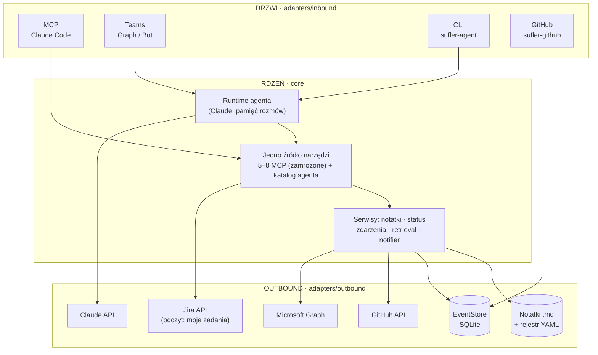

# Sufler

[](https://www.python.org/)
[](https://github.com/BIAP-Inteligentne-Technologie/PIWorkmate/actions/workflows/ci.yml)
[](CHANGELOG.md)
[](LICENSE)

**Wewnętrzny serwer MCP i runtime agenta pionu Inteligentnych Technologii BIAP** — wspólna baza
wiedzy o projektach, dostępna tam, gdzie zespół już pracuje: w Claude Code, na Teams i w GitHubie.
Notatki ze spotkań i status projektów trafiają do jednej, przeszukiwalnej bazy zamiast rozproszonych
plików; GitHub i Teams rozmawiają ze sobą, a Jira odpowiada na pytanie „jakie mam otwarte zadania"
bez opuszczania rozmowy.

## Status

**Produkcyjny — kod Fazy 1–4 domknięty.** Serwer MCP, runtime agenta w rdzeniu, drzwi
Teams/CLI/GitHub, most GitHub ↔ EventStore ↔ Teams (z bramkowanym zapisem), odczyt Jira, grafik
Shifts oraz lokalny retrieval leksykalny notatek. Powłoka `Bash` w kontenerze-wykonawcy i narzędzie
`File` są wdrożone i włączone na flocie w zakresie `read` i `edit`; kasowanie notatek stoi za
osobną bramką, związaną z działającą kopią zapasową, i na flocie jest zamknięte
([`docs/roadmap.md`](docs/roadmap.md), pomiar 2026-09-09).

Decyzje architektoniczne żyją w [`docs/adr/`](docs/adr/); co niesie które wydanie, mówi
[`CHANGELOG.md`](CHANGELOG.md). Wersję pakietu, obrazu i badge'a wyżej wiąże jedna bramka
(`tests/test_version_consistency.py`) — rozjazd między nimi zapala CI na czerwono.

Otwarte: meta Fazy 1, czyli wdrożenie HTTP na serwerze firmowym
([`docs/roadmap.md`](docs/roadmap.md) §Bramka 3, [`docs/roadmap-v1-gap-analysis.md`](docs/roadmap-v1-gap-analysis.md)).
Karty czasu (WorklogPRO) zostały wycofane z projektu w całości, nie wstrzymane
([ADR 0055](docs/adr/0055-withdraw-worklogpro-timesheets.md)).

Stan bramek jakości pokazuje badge CI na górze — biegają na `Main`, `Dev`, PR-ach do tych dwóch
gałęzi oraz nocą. Na **PR-ze** zakres jest zawężony do tego, czego zmiana dotyczy: wpis `sufler`
biegnie zawsze, bo to on niesie bramki chodzące po całym drzewie (martwe odsyłacze, numeracja ADR,
spójność wersji), a pozostałe wpisy macierzy i obie budowy obrazów — tylko gdy zmiana sięga ich
katalogów. Na `Main`, nocą i przy `workflow_dispatch` biegnie **komplet**, bo tam pytanie brzmi
„czy drzewo jest zdrowe", a nie „czy ta zmiana jest bezpieczna".

## Mapa repozytorium

Repozytorium mieści cztery jednostki. Każda ma osobne środowisko `uv` i własny wpis w matrycy CI
([`.github/workflows/ci.yml`](.github/workflows/ci.yml)). Czwarta dostaje dodatkowo przebieg na
Windows i na drugiej wersji Pythona
([`.github/workflows/ceidg-tool.yml`](.github/workflows/ceidg-tool.yml)), instalowany `pipem`
z `requirements.lock` — czyli z TEGO SAMEGO rozwiązania zależności co `uv.lock` w matrycy, czego
pilnuje `ceidg-tool/tests/test_locki_zgodne.py` (do #157 instalacja szła z zakresów i bramka nie
wiedziała, który program sprawdza). Tamta matryca niesie wyłącznie osie, których `ci.yml` nie ma:
drugi system i drugą wersję Pythona. Opis każdej jednostki mieszka u niej — tutaj jest tylko
wskazówka, dokąd iść.

**Rdzeń `sufler`** (`src/`, `tests/`, `docs/`, `deploy/`, `eval/`, `scripts/`) — to, co opisuje
reszta tego pliku: serwer MCP, runtime agenta, drzwi i most zdarzeń.

**[`Powiadomienia_teams/`](Powiadomienia_teams/README.md)** — cotygodniowy asystent uzupełniania
zmian w Microsoft Shifts. W piątek wykrywa, kto nie ma zmian na następny tydzień pracujący, pisze
do niego 1:1 i — po jawnym potwierdzeniu — wpisuje zmiany za pracownika. Samodzielny pod-projekt
z własnym `Dockerfile`, `CHANGELOG.md` i [`PLAN.md`](Powiadomienia_teams/PLAN.md); jego niezmienniki
bierz z `PLAN.md`, nie stąd. Jego `src/` to źródła **odzyskane z obrazu produkcyjnego**, a numer
wersji śledzi tag obrazu Docker, nie `pyproject.toml`.

**[`claude_summary/`](claude_summary/README.md)** — narzędzie CLI zestawiające, co dana osoba robiła
każdego dnia: historia promptów Claude Code (za jawną zgodą, bramkowaną typem) plus historia commitów,
z redakcją treści wrażliwej na granicy parsowania. Materiał wejściowy dla ścieżki worklogu.
Zamysł i status: [`PLAN.md`](claude_summary/PLAN.md). Ten katalog jest kopią referencyjną kontraktu
i kodu, nie źródłem prawdy o wersji uruchomionej u konkretnej osoby.

**[`ceidg-tool/`](ceidg-tool/README.md)** — **inny produkt, mieszkający w tym repozytorium**:
pobiera dane o jednoosobowych działalnościach gospodarczych z API v3 Hurtowni Danych CEIDG
i zapisuje je do skoroszytu Excel, z kreatorem dla osoby nietechnicznej i trybem `--demo` bez
sieci. Do 2026-09-10 żył na osobnej gałęzi bez wspólnego przodka z `Main`; wszedł tutaj jako
czwarty pod-projekt decyzją [ADR 0074](docs/adr/0074-where-ceidg-tool-should-live.md), z całą
historią (36 commitów, autorstwo ujednolicone przy imporcie).
Ma własny `pyproject.toml`, własną numerację ADR-ów w [`ceidg-tool/docs/`](ceidg-tool/docs/)
i własny `CLAUDE.md`; asystent językowy jest u niego extrasem, nie zależnością. Pola `license`
nie ma — obowiązuje [`LICENSE`](LICENSE) korzenia, tak jak w pozostałych pod-projektach.
**Żadne poświadczenie nie jest tu dołączone** — ani token CEIDG, ani klucz API asystenta; `.env`
jest ignorowany i nigdy nie był śledzony (skan całej bazy obiektów po wartości i po kształcie
sekretu, 2026-09-24). Kto klonuje, wstawia **własny** token, a uzyskuje go usługą
[biznes.gov.pl](https://www.biznes.gov.pl/pl/e-uslugi/00_9999_00) przez Profil Zaufany — czyli nie
od ręki. Bez tokenu każde polecenie rozstrzygające ustawienia kończy się kodem wyjścia 3 i zdaniem
zaczynającym się od „Brak tokenu:"; działają za to `token zapisz|usun` oraz tryb `--demo`, który
odpowiada z rejestru syntetycznego generowanego w pamięci procesu, bez sieci i bez tokenu.

**[`krs-tool/`](krs-tool/README.md)** — **trzeci produkt w tym drzewie**: czyta odpis z Krajowego
Rejestru Sądowego, **zapisany ręcznie przez operatora**, i wystawia raport o sygnałach
rejestrowych spółki. Piąty pod-projekt od 2026-09-11, powołany przez
[`ceidg-tool/docs/adr/0023`](ceidg-tool/docs/adr/0023_krs_company_risk_assessment.md), z własną
numeracją ADR-ów w [`krs-tool/docs/`](krs-tool/docs/) i własnym `CLAUDE.md`. Jedna rzecz odróżnia
go od wszystkiego innego w tym repozytorium i trzeba ją znać, zanim się tknie kod: **nie ma tu
klienta HTTP ani żadnej zależności sieciowej** — nie przez flagę, tylko przez nieobecność
w grafie importów i w manifeście, pilnowaną przez trzech niezależnych obserwatorów. Powód jest
prawny (art. 60a ustawy o KRS) i obejmuje także rozwój i testy.

## Zdolności

| Obszar | Co potrafi |
|--------|-----------|
| **Baza wiedzy (MCP)** | 4 narzędzia odczytu (wyszukiwanie, odczyt notatki, lista projektów, status projektu) + jedno bramkowane narzędzie zapisu (`save_note`, tylko dokłada, nigdy nie nadpisuje). Do tego trzy narzędzia **addytywne**, wchodzące pod dwoma warunkami konfiguracji: odczyt zdarzeń mostu, gdy podłączony jest most zdarzeń ([ADR 0040](docs/adr/0040-eventstore-to-mcp-session-cursor-read.md)), oraz para „moje zadania"/„moja historia" w Jirze, gdy operator skonfigurował stałe konto — jeden rejestrator wystawia obie. |
| **Agent na drzwiach Teams/CLI/GitHub** | Ten sam katalog narzędzi napędza runtime agenta (model Claude w pętli) z pamięcią rozmów i kompaktowaniem historii. |
| **Powłoka `Bash`** | Polecenia od modelu biegną w osobnym kontenerze-wykonawcy **bez sieci**, stawianym per rozmowa i widzącym wyłącznie jej brudnopis; wejście za bramką członkostwa pionu ([ADR 0057](docs/adr/0057-shell-executor-container-without-network.md), [ADR 0063](docs/adr/0063-shell-membership-gate-and-conversation-isolation.md)). |
| **Narzędzie `File` i mutacja bazy wiedzy** | `read` materializuje plik (obraz/PDF/HTML) do kontekstu modelu; `edit` zmienia istniejącą notatkę — przez niezależnego sędziego-model, migawkę przed zmianą i punkt kontrolny człowieka przy werdykcie `confirm`. Trzecia akcja, `delete`, ma **osobną bramkę** i przy jej zamknięciu nie wchodzi nawet do listy akcji ([ADR 0064](docs/adr/0064-file-tool-and-model-initiated-materialization.md), [ADR 0065](docs/adr/0065-mutable-knowledge-base-and-model-judged-writes.md)). |
| **Most GitHub ↔ EventStore ↔ Teams** | Ingest zdarzeń issue/PR/komentarzy/recenzji/CI oraz zamknięć issue ([ADR 0071](docs/adr/0071-issue-closures-and-what-self-skip-was-actually-skipping.md)); push na kanał i czat 1:1; dwukierunkowe wątki; z Teams zakładanie issue i odpowiedź w wątku na GitHubie. |
| **Jira — odczyt (moje/członka zespołu, historia, szczegóły)** | Moje otwarte i zakończone zadania, szczegóły jednego zgłoszenia (+komentarze), wyszukiwanie, zadania/historia INNEGO członka pionu przez zaufaną mapę tożsamości — nadal zero zapisu ([ADR 0054](docs/adr/0054-reduce-jira-to-read-only-my-tasks.md), [ADR 0059](docs/adr/0059-teams-shifts-schedule-read.md)). |
| **Grafik Teams Shifts (odczyt)** | Kto pracuje dziś/w tygodniu, stacjonarnie czy zdalnie, kto ma wolne — tożsamość pożyczona z cache bota powiadomienia-teams, bez osobnej rejestracji aplikacji ([ADR 0059](docs/adr/0059-teams-shifts-schedule-read.md)). |
| **Notatki ze spotkań z transkryptu** | Agent czyta transkrypt spotkania Teams i zapisuje ustrukturyzowaną notatkę — uczestnicy liczeni deterministycznie z transkryptu, nie z modelu. |
| **Retrieval leksykalny (BM25)** | Wyszukiwanie notatek nad lematami (polski `simplemma`), z fallbackiem podłańcuchowym; jakość pilnowana mikro-evalem w `eval/`. |
| **Katalog procedur** | Opisy powtarzalnej pracy montowane read-only pod `/mnt/skills`; model czyta je tą samą powłoką, którą już ma. Bez ustawionej ścieżki lista jest pusta i zachowanie jest dokładnie dawne. |

Obie liczby narzędzi MCP — pięć zamrożonych i trzy addytywne — trzyma golden-test
`tests/adapters/test_mcp_tool_surface.py`, którego baseline obejmuje wszystkie osiem i biega
w czterech konfiguracjach.

Powierzchnia agenta liczy osiem narzędzi z włączoną powłoką i czternaście bez niej — bez powłoki
dochodzą narzędzia odczytu bazy wiedzy, katalog roboczy i odpowiedź plikiem, bo nie ma czym ich
zastąpić. Komplet obu wariantów, repertuar akcji każdego narzędzia i sufit bajtów opisów trzyma
jedna bramka: `tests/core/test_tool_descriptions.py`.

Pełna specyfikacja parametrów i wyników narzędzi: [`docs/reference/tools.md`](docs/reference/tools.md).

### Czego Sufler nie robi

Kilka z tych granic jest wynikiem świadomego wycofania, a nie braku czasu:

- **Jira: wyłącznie odczyt.** Nie zakłada zgłoszeń, nie komentuje, nie zmienia statusów — w kodzie
  nie ma ścieżki zapisu, a Jira nie jest częścią mostu zdarzeń
  ([ADR 0054](docs/adr/0054-reduce-jira-to-read-only-my-tasks.md)). Konto Jira nigdy nie przychodzi
  od modelu.
- **Karty czasu (WorklogPRO) wycofane w całości** — cotygodniowe arkusze i tryb self-service nie
  istnieją i nie wrócą ([ADR 0055](docs/adr/0055-withdraw-worklogpro-timesheets.md)). Akcja
  `worklog` na powierzchni aktywności to co innego: estymacja czasu z commitów.
- **Zapis jest domyślnie wyłączony wszędzie.** Kod zdolności mutującej może być w drzewie i mimo to
  być nieosiągalny — bramkę otwiera dopiero operator. Pilnuje tego
  `tests/test_gates_closed_by_default.py`, który odkrywa bramki refleksyjnie i sprawdza także
  szablony konfiguracji.
- **Drzwi HTTP nie piszą.** Transport `streamable-http` wymusza wyłączony zapis niezależnie od
  konfiguracji i nie wystawia narzędzi Jiry, bo jedno skonfigurowane konto na proces nie obsłuży
  wielu osób ([ADR 0007](docs/adr/0007-gate-3-http-auth-deployment.md)).
- **Powierzchnia narzędzi MCP jest zamrożona.** Nowe narzędzie na tych drzwiach zrywa golden-test
  (`tests/adapters/test_mcp_tool_surface.py`) i wymaga ADR-a, zanim wejdzie.
- **Notatki ze spotkań i wątków są niezmienne** — ich niezmienność jest mechanizmem idempotencji,
  nie ostrożnością.
- **Retrieval gęsty jest zbudowany, ale wyłączony** — wchodzi dopiero po przejściu bramki
  mikro-evalu ([ADR 0039](docs/adr/0039-gated-local-dense-retrieval.md)).

## Architektura w skrócie

Sufler realizuje zasadę **„jeden rdzeń, wiele drzwi"**: cała logika i cała wartość mieszkają
w jednym, niezależnym od interfejsu rdzeniu (`core/`), a każdy kanał dostępu — Claude Code przez
MCP, Teams, CLI, GitHub — jest cienkim adapterem nad tym samym katalogiem narzędzi. Dzięki temu
nowa zdolność (narzędzie, drzwi, integracja) powstaje raz i jest dostępna wszędzie, zamiast być
duplikowana per kanał.

**Żelazna reguła zależności:** `core/` nigdy nie importuje z `adapters/` — tylko adaptery znają
rdzeń, nigdy odwrotnie. Egzekwuje ją import-linter jako osobny krok CI.

```
src/sufler/
├── core/                  # RDZEŃ — bez I/O, bez SDK
│   ├── domain/             # modele + czysta logika
│   ├── ports/               # interfejsy (repozytoria, LLM, GitHub, Jira, notyfikacje…)
│   ├── application/    # przypadki użycia + jednoźródłowy katalog narzędzi
│   └── agent/              # runtime agenta
├── adapters/
│   ├── inbound/    # DRZWI: mcp, teams, teams_graph, cli, github…
│   └── outbound/  # KLIENCI zewnętrznych API
├── server.py               # wiring serwera MCP
└── config/                 # ustawienia SUFLER_* — moduł na domenę, re-eksport w __init__
```



**Most** (Fazy 3–4) spina GitHub ze wspólnym magazynem zdarzeń i Teams — nikt nie woła nikogo
bezpośrednio, komunikacja idzie przez append-only `EventStore` z deduplikacją. Jira nie jest
częścią tego mostu ([ADR 0054](docs/adr/0054-reduce-jira-to-read-only-my-tasks.md)) — "moje
zadania" to bezpośrednie zapytanie agenta/MCP do Jiry, zawężone do konta pytającego, bez zdarzeń
i bez zapisu:

```mermaid
flowchart LR
    GH["GitHub<br/>issue · PR · CI · review"] -->|poller PAT| ES[("EventStore")]
    ES -->|notifier| TEAMS["Teams<br/>kanał + czat 1:1"]
    TEAMS -->|agent · bramka zapisu| GH
    TEAMS -->|agent/MCP · odczyt "moje zadania"| JR["Jira API"]
```

Szczegóły i pełne diagramy warstw: [`docs/explanation/architecture.md`](docs/explanation/architecture.md).

## Szybki start

Wymagania: **Python 3.11+** oraz [`uv`](https://docs.astral.sh/uv/). Dolna granica jest równa
wersji, na której cokolwiek tu biega. `tests/deploy/test_python_version_floor.py` wiąże
`requires-python` z dwoma miejscami, które da się sprawdzić plikiem: `.python-version` i obrazem
bazowym z `deploy/docker/Dockerfile`. CI nie jest osobnym dowodem — bierze wersję z
`.python-version` przez `setup-uv`, więc pilnuje jej ta sama sonda.

```bash
# Instalacja rdzenia (serwer MCP działa bez sekretów, na lokalnych plikach)
uv sync

# Serwer MCP lokalnie (transport stdio) + podgląd narzędzi
uv run sufler
uv run mcp dev src/sufler/server.py
```

**Podłączenie do Claude Code** — repozytorium zawiera [`.mcp.json`](.mcp.json) (scope `project`),
więc po otwarciu Claude Code w tym katalogu serwer `sufler` pojawia się automatycznie; ten sam
plik podłącza pomocniczy serwer `code-review-graph` do nawigacji po kodzie. Narzędzie zapisu
`save_note` jest domyślnie WYŁĄCZONE (Bramka 2, [ADR 0006](docs/adr/0006-write-capability-gate-2.md))
— skopiuj [`.env.example`](.env.example) do `.env`, żeby je włączyć lokalnie.

Pozostałe drzwi i zdolności wymagają dodatkowych extras `uv sync --extra <nazwa>`:

| Extra | Odblokowuje |
|-------|-------------|
| `agent` | Runtime agenta (CLI, Teams) — wymaga klucza Claude API. |
| `teams` | Drzwi Teams w trybie Bot Framework. |
| `teams-graph` | Drzwi Teams w trybie delegowanego Microsoft Graph (notatki ze spotkań, digest, załączniki). |
| `github` | Most GitHub ↔ Teams (polling PAT). |
| `jira` | Jira — moje zadania (dual-provider: server/cloud). |
| `retrieval` | Retrieval leksykalny BM25 (lematyzacja PL, `simplemma`). |
| `retrieval-dense` | Retrieval gęsty ([ADR 0039](docs/adr/0039-gated-local-dense-retrieval.md)) — zbudowany, domyślnie OFF za bramką mikro-evalu. |
| `file-reply` | Odpowiedź plikiem (PDF) w wątku Teams. |
| `seed` | Import korpusu początkowego z dokumentów Office/PDF (narzędzie operatorskie). |

### Polecenia

Każde drzwi i każde narzędzie operatorskie to osobny console-script. Część działa po samym
`uv sync`; drzwi Teams, GitHub i Jiry wymagają odpowiedniego extra z tabeli wyżej:

| Polecenie | Co uruchamia |
|-----------|--------------|
| `sufler` | Serwer MCP (stdio) — baza wiedzy i narzędzia dla Claude Code. |
| `sufler-agent` | Lokalny runtime agenta z linii komend. |
| `sufler-meeting` | Harness notatki ze spotkania poza Teams ([ADR 0009](docs/adr/0009-meeting-note-flow-and-write-surface.md)). |
| `sufler-teams` | Drzwi Teams w trybie Bot Framework. |
| `sufler-teams-graph` | Drzwi Teams w trybie delegowanego Microsoft Graph. |
| `sufler-github` | Most GitHub — polling zdarzeń PAT. |
| `sufler-teams-digest` | Proaktywny cotygodniowy digest zmian ([ADR 0053](docs/adr/0053-proactive-weekly-change-digest.md)). |
| `sufler-search` | Wyszukiwarka notatek dla powłoki agenta — ten sam ranker co narzędzie, nie `grep`. |
| `sufler-render` | Renderer pliku (`pdf`/`docx`) do skrzynki wyjściowej powłoki. |
| `sufler-extract` | Ekstraktor tekstu z PDF/docx/xlsx/pptx/HTML dla powłoki ([ADR 0064](docs/adr/0064-file-tool-and-model-initiated-materialization.md)). |
| `sufler-exec` | Kontener-wykonawca poleceń powłoki — osobny proces bez sieci ([ADR 0057](docs/adr/0057-shell-executor-container-without-network.md)). |
| `sufler-exec-manager` | Menedżer wykonawców: stawia i gasi wykonawcę na rozmowę, montując mu wyłącznie jej brudnopis ([ADR 0063](docs/adr/0063-shell-membership-gate-and-conversation-isolation.md)). |
| `sufler-heartbeat-check` | Healthcheck pulsu pollerów (używany przez `docker compose`). |
| `sufler-metrics` | Raport metryk użycia (licznik SQLite, pseudonimizowany). |
| `sufler-diagnostics` | Odczyt dziennika audytu i obu kwarantann ([ADR 0069](docs/adr/0069-inbound-message-dead-letter-and-bounded-handling.md)) — patrz „Wdrożenie". |
| `sufler-seed-corpus` | Import korpusu początkowego notatek — dry-run domyślnie. |

## Konfiguracja

Pełna macierz zmiennych `SUFLER_*` (co każda bramka włącza i czego wymaga):
[`docs/how-to/gate-matrix.md`](docs/how-to/gate-matrix.md). Wzorzec pliku środowiskowego:
[`.env.example`](.env.example) — wartości sekretów i identyfikatorów tenanta trzymamy wyłącznie
w `.env` (gitignorowany), nigdy w dokumentacji czy kodzie.

**Bramka zdolności mutującej**, włączona a niekompletnie skonfigurowana, jest twardym błędem startu,
a nie cichym brakiem funkcji: drzwi wołają `validate()` na swoich klasach ustawień, zanim ruszy
pierwsza tura. **Zdolności addytywne zachowują się odwrotnie i jest to zamierzone** — niekompletna
konfiguracja Jiry daje ciche pominięcie narzędzia zamiast zatrzymania procesu, a błędy tokenu czy
zgody administratora przy grafiku Shifts materializują się dopiero przy wywołaniu narzędzia.
Zdolność, której nie ma, ma nie wywracać drzwi, przez które i tak przechodzą wszystkie pozostałe.

## Testy i bramki

```bash
uv run --no-sync pytest                                         # testy — pełny pakiet
uv run --no-sync pytest --testmon                               # iteracja lokalna
uv run --no-sync ruff check src tests eval deploy scripts
uv run --no-sync ruff format --check src tests eval deploy scripts
uv run --no-sync mypy
uv run --no-sync lint-imports                                   # granice core ↛ adapters
```

`--no-sync` omija blokadę pliku wykonywalnego na Windows. Powyższe to komplet bramki jakości z CI
([`.github/workflows/ci.yml`](.github/workflows/ci.yml)), z dwoma szczegółami, o które łatwo się
potknąć: **`ruff format --check` jest osobnym krokiem, nie skutkiem `ruff check`**, a `lint-imports`
biega wyłącznie dla rdzenia, bo pod-projekty nie mają import-lintera. Każdy krok **bramki** ma
warunek `!cancelled()`, żeby czerwony test nie przykrył wyniku pozostałych.

Pod-projekty mają własne środowiska i uruchamia się je osobno, z tym samym zestawem extras, którego
używa CI — inaczej ten sam pakiet testów biegnie u Ciebie i w bramce w dwóch różnych środowiskach:

```bash
cd Powiadomienia_teams && uv run --extra agent pytest
cd claude_summary && uv run pytest
cd ceidg-tool && uv run --extra dev --extra asystent pytest
```

CI buduje też oba obrazy — floty (`deploy/docker/Dockerfile`) i pod-projektu powiadomień — więc
ścieżka wdrożeniowa nie stoi na zdaniu, którego nikt nie sprawdza. **Etap `test` wewnątrz
`Dockerfile` floty nie jest jednak gwarancją**, że obraz nie powstanie z czerwonego drzewa: jego
marker to pusty plik, więc bez `--no-cache-filter test` BuildKit podstawia warstwę z cache'u. W CI
etap biegnie tylko dlatego, że runner startuje z pustym cache'em.

Z tego samego powodu obie budowy są na **PR-ze warunkowe**: skoro etap `test` powtarza pakiet
testów, który przed chwilą przeszedł we wpisie macierzy, to na zmianie, która do obrazu nie
wchodzi, jest wyłącznie drugim przebiegiem tej samej suity (zmierzone 2026-09-24: 84 s i 83 s,
czyli 38 % czasu zadań całego przebiegu). Na `Main`, nocą i ręcznie budują się **zawsze** — bez
tego bieg nocny przestałby odpowiadać na pytanie, po które powstał: czy obraz w ogóle dziś wstaje.

## Wdrożenie

Wdrożenie kontenerowe (Docker Compose, obraz floty, profile usług):
[`deploy/docker/README.md`](deploy/docker/README.md). Szkielet windowsowy (IIS + usługa Windows)
dla transportu HTTP: [`deploy/http/README.md`](deploy/http/README.md).

Segmenty usług włącza się profilami compose, a stan (baza zdarzeń, cache MSAL, kursory pollerów)
mieszka na wolumenach poza obrazem. Zapis stanu jest atomowy, a odczyt tolerancyjny — uszkodzony
lub brakujący plik daje pusty stan i ostrzeżenie, nie zatrzymanie usługi.

### Diagnostyka po incydencie

Trzy magazyny obserwowalności czyta jedno polecenie — dziennik audytu (`audit`), kwarantannę
zdarzeń niewysłanych (`dead-letters`) i kwarantannę wiadomości porzuconych przez drzwi
(`inbound`). Ścieżka bazy nie jest zaszyta: `--db` albo zmienna (`SUFLER_EVENTS_DB` dla obu
kwarantann, `SUFLER_AUDIT_DB` dla audytu). Połączenie jest tylko do odczytu — bazę w tej samej
chwili piszą procesy drzwi.

```bash
sufler-diagnostics inbound --since 24h                 # kto nie dostał odpowiedzi
sufler-diagnostics dead-letters --source github --since 7d
sufler-diagnostics audit --source teams_graph --limit 100 --json
```

Wpis niesie identyfikatory (kanał, wątek, id wiadomości, nadawca po AAD id), powód i czas —
**nigdy treści**. Kwarantanna ma pomóc wiadomość ODNALEŹĆ w Teams, nie ją odtworzyć
([ADR 0069](docs/adr/0069-inbound-message-dead-letter-and-bounded-handling.md) §5).

## Dokumentacja

Dokumentacja jest uporządkowana wg [Diátaxis](https://diataxis.fr/) — patrz [`docs/README.md`](docs/README.md):

- **Tutorial** (`docs/tutorial/`) — nauka przez działanie: uruchomienie systemu od zera.
- **How-to** (`docs/how-to/`) — konkretne procedury operacyjne: wdrożenie, aktywacja drzwi, smoke test.
- **Reference** (`docs/reference/`) — fakty do sprawdzenia: narzędzia, konfiguracja, schemat notatki.
- **Explanation** (`docs/explanation/`) — kontekst i uzasadnienie: architektura systemu.
- **ADR** ([`docs/adr/`](docs/adr/)) — zapis decyzji architektonicznych, od układu heksagonalnego
  wzwyż; numeracja rośnie z każdą decyzją, więc katalog jest jedynym aktualnym spisem.
- **Research** (`docs/research/`) — notatki badawcze uzasadniające wybory techniczne.

Zmiany między wersjami: [`CHANGELOG.md`](CHANGELOG.md). Chcesz coś zmienić? →
[`CONTRIBUTING.md`](CONTRIBUTING.md).

## Bezpieczeństwo

Bezpieczeństwo jest ograniczeniem na każdą funkcję, nie osobnym modułem:

- **Odczyt jest domyślny; zapis jest bramkowany.** Każda zdolność mutująca ma własną, domyślnie
  wyłączoną bramkę, włączaną per drzwi.
- **Treść notatek i zdarzeń to dane, nie polecenia** — postawa, nie granica. **Egzekwowane**
  maszynowo są wyłącznie znaki sterujące (`reject_dangerous_content`, `strip_control_chars`) — to
  jedyne miejsce, w którym coś zostaje odrzucone lub wycięte. Klasy zaufania T0–T3
  ([ADR 0066](docs/adr/0066-content-trust-classes-and-sticky-conversation-taint.md)) treść
  **etykietują**, a nie blokują: koperta z nonce'em na turę mówi modelowi, skąd tekst pochodzi,
  niczego nie zabraniając — i jest domyślnie wyłączona. Reszta kształtuje zachowanie modelu.
  **To nie jest obrona przed wstrzyknięciem promptu** — tą są bramki zdolności, montaż `ro`,
  wykonawca bez sieci i odwracalność.
- **Zamrożony kontrakt narzędzi i schematu notatki** — pilnowany golden-testem.
- **Sekrety poza zasięgiem rdzenia** — czytane z env/plików poza `data/`, nigdy w repo.
- **Testy bezpieczeństwa w CI** — wstrzyknięcia, path traversal, wyciek sekretów
  ([`tests/security/`](tests/security/)).

## Licencja i kontakt

Oprogramowanie własnościowe — **All Rights Reserved © BIAP – Pion Inteligentnych Technologii**.
Szczegóły: [`LICENSE`](LICENSE). Pytania i propozycje zmian: [`CONTRIBUTING.md`](CONTRIBUTING.md).
