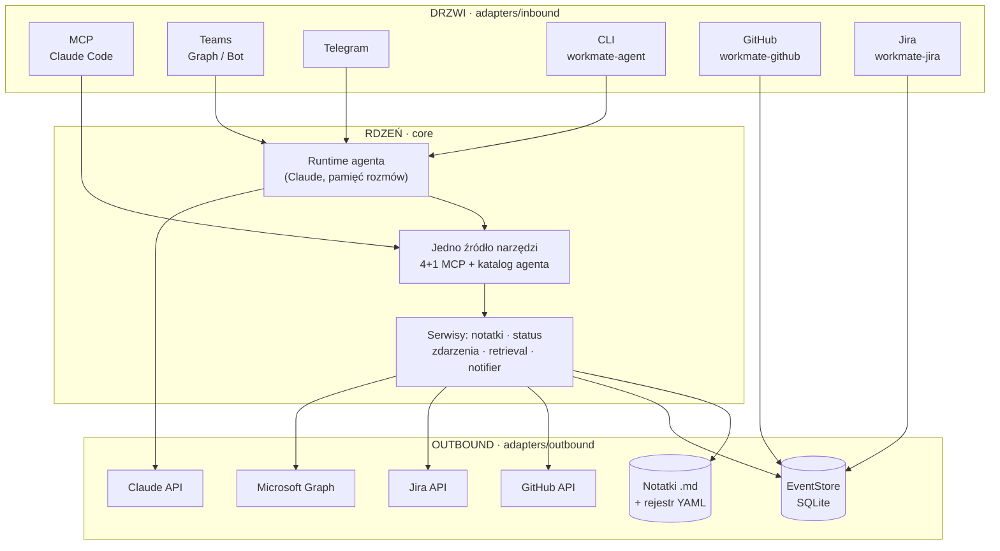
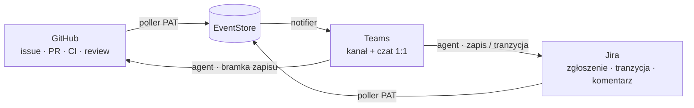

# WorkMate

[](https://www.python.org/)
[](https://github.com/BIAP-Inteligentne-Technologie/PIWorkmate/actions/workflows/ci.yml)
[](CHANGELOG.md)
[](LICENSE)

**Wspólna baza wiedzy pionu Inteligentnych Technologii — jedno źródło prawdy o projektach,
dostępne tam, gdzie zespół już pracuje.** Notatki ze spotkań i status projektów są wystawione
jako wąskie, typowane narzędzia, z których korzysta Claude Code, asystent na Teams/Telegramie
oraz automatyczny most do GitHuba — zamiast rozproszonych plików, do których nikt nie zagląda.

> **Status: 🟢 Produkcyjny — Fazy 1–4 + most Jira domknięte.** Serwer MCP, runtime agenta w rdzeniu,
> drzwi Teams/Telegram/CLI/GitHub/Jira, most GitHub/Jira ↔ EventStore ↔ Teams (z bramkowanym zapisem
> i tranzycją statusu Jiry) oraz lokalny retrieval leksykalny notatek. 32 decyzje architektoniczne
> (`docs/adr/`), zestaw testów w pełni zielony.

---

## Co to daje zespołowi

- **Koniec z „gdzie to ustaliliśmy?"** — pytasz w naturalnym języku (Claude Code, Teams, Telegram),
  a WorkMate odpowiada na podstawie realnych notatek i statusów, z odnośnikiem do źródła.
- **Notatki ze spotkań trafiają od razu do wspólnej bazy** — jedno narzędzie zapisu (`save_note`),
  ustrukturyzowane, bez ryzyka nadpisania cudzej pracy.
- **GitHub, Jira i Teams rozmawiają ze sobą** — nowe issue, PR, wynik CI, recenzja czy zgłoszenie
  Jira pojawiają się na kanale zespołu; z Teams można założyć issue/zgłoszenie, przesunąć status
  w Jirze lub odpowiedzieć w wątku wprost na GitHubie.
- **Bezpieczeństwo wpisane w architekturę** — domyślnie tylko odczyt, każda zdolność zapisu za
  osobną bramką, treść notatek traktowana jak dane (odporność na wstrzyknięcia), sekrety poza repo.

## Architektura: „jeden rdzeń, wiele drzwi"

Cała wartość i cała logika mieszka w **rdzeniu** (`core/`) — niezależnym od interfejsu. Kanały
dostępu („**drzwi**", `adapters/`) to cienkie adaptery nad **tym samym** katalogiem narzędzi.
Reguła, która to spina: `core/` nigdy nie importuje z `adapters/`.



**Most** (Fazy 3–4 + seria B) spina GitHub i Jirę ze wspólnym magazynem zdarzeń i Teams — nikt nie
woła nikogo bezpośrednio, komunikacja idzie przez append-only `EventStore` z deduplikacją:



Szczegóły i pełne diagramy warstw: [`docs/explanation/architecture.md`](docs/explanation/architecture.md).

## Możliwości

| Obszar | Co potrafi |
|--------|-----------|
| **Baza wiedzy (MCP)** | Wyszukiwanie, odczyt i status projektów jako typowane narzędzia dla Claude Code; jedno bramkowane narzędzie zapisu notatek. |
| **Runtime agenta** | Ten sam katalog narzędzi napędza agenta (model Claude w pętli) na drzwiach Teams/Telegram/CLI — z pamięcią rozmów i kompaktowaniem historii. |
| **Most GitHub ↔ Teams** | Ingest zdarzeń issue / PR / komentarzy / recenzji / CI; push na kanał i czat 1:1; dwukierunkowe wątki; z Teams zakładanie issue i odpowiedź w wątku na GitHubie; deterministyczny auto-komentarz przy porażce CI. |
| **Most Jira ↔ Teams** | Ingest zgłoszeń / tranzycji statusu / komentarzy z Jira Server/DC; push na kanał i czat 1:1; wątkowanie kanału (jeden wątek na zgłoszenie); z Teams bramkowane tworzenie zgłoszeń/komentarzy (create-only) i best-effort tranzycja statusu. |
| **Załączniki multimodalne** | Agent czyta wrzucone na Teams obrazy (PNG/JPEG/GIF/WEBP/HEIC), PDF oraz dokumenty Office (DOCX/XLSX/PPTX) — z łagodną degradacją. |
| **Retrieval leksykalny** | Wyszukiwanie notatek oparte na BM25 nad lematami (polski `simplemma`), z fallbackiem podłańcuchowym; jakość pilnowana mikro-evalem. |
| **Wdrożenie sieciowe** | Tryb `streamable-http` z uwierzytelnianiem per osoba (token bearer) i drzwiami tylko do odczytu. |

## Narzędzia

Powierzchnia **MCP** to zamrożone 4 + 1 narzędzi (pilnowane golden-testem). Runtime agenta widzi
dodatkowo narzędzia warstwy roboczej i mostu, wstrzykiwane per drzwi:

| Narzędzie | Powierzchnia | Do czego |
|-----------|--------------|----------|
| `search_notes` | MCP | Szuka notatek po słowach kluczowych i metadanych (filtry: projekt, uczestnik). |
| `get_note` | MCP | Zwraca pełną treść notatki po identyfikatorze. |
| `list_projects` | MCP | Wypisuje projekty pionu z rejestru. |
| `get_project_status` | MCP | Status projektu: część zadeklarowana z rejestru + synteza z notatek. |
| `save_note` | MCP (zapis, Bramka 2) | Dodaje notatkę do katalogu `firma/projekt` — nigdy nie nadpisuje. |
| `read_recent_events` | agent (most) | Podgląd ostatnich zdarzeń z `EventStore` (GitHub/Jira/Teams). |
| `create_github_issue` / `comment_github_issue` | agent (Bramka 4) | Tworzy issue / komentarz na skonfigurowanym repo (create-only). |
| `create_jira_issue` / `comment_jira_issue` | agent (Gate 5) | Tworzy zgłoszenie / komentarz w skonfigurowanym projekcie Jira (create-only). |
| `transition_jira_issue` | agent (tranzycja) | Przesuwa status zgłoszenia Jira (best-effort walk po workflow). |
| `reply_on_thread` | agent (wątek) | Odpowiada komentarzem na issue/PR powiązanym z wątkiem Teams. |
| `create_file` / `read_file` / `list_files` | agent (katalog roboczy) | Robocze pliki tekstowe agenta per rozmowa. |

Pełna specyfikacja parametrów i wyników: [`docs/reference/tools.md`](docs/reference/tools.md).

## Szybki start

Wymagania: **Python 3.10+** oraz [`uv`](https://docs.astral.sh/uv/).

```bash
# Instalacja rdzenia (serwer MCP działa bez sekretów, na lokalnych plikach)
uv sync

# Testy i bramka jakości
uv run pytest
uv run ruff check . && uv run mypy

# Serwer MCP lokalnie (transport stdio) + podgląd narzędzi
uv run workmate
uv run mcp dev src/workmate/server.py
```

**Podłączenie do Claude Code** — repozytorium zawiera [`.mcp.json`](.mcp.json) (scope `project`),
więc po otwarciu Claude Code w tym katalogu serwer `workmate` pojawi się automatycznie. Następnie
zapytaj np. *„co ustaliliśmy z mpwik w sprawie API?"*.

**Pozostałe drzwi** (wymagają dodatkowych extras i konfiguracji):

| Drzwi | Uruchomienie | Przewodnik |
|-------|--------------|-----------|
| Runtime agenta (CLI) | `uv sync --extra agent` · `uv run workmate-agent "…"` | — |
| Teams (delegowany Graph) | `uv sync --extra teams-graph --extra agent` · `uv run workmate-teams-graph` | [`how-to/teams-graph.md`](docs/how-to/teams-graph.md) |
| Most GitHub ↔ Teams | `uv sync --extra github --extra teams-graph` · `uv run workmate-github` | [`how-to/github-bridge.md`](docs/how-to/github-bridge.md) |
| Most Jira ↔ Teams | `uv sync --extra jira --extra teams-graph` · `uv run workmate-jira` | [`how-to/jira-bridge.md`](docs/how-to/jira-bridge.md) |
| Telegram | `uv sync --extra telegram --extra agent` · `uv run workmate-telegram` | [`how-to/telegram-bot.md`](docs/how-to/telegram-bot.md) |
| Retrieval BM25 | `uv sync --extra retrieval` (aktywuje lematyzację PL) | [ADR 0023](docs/adr/0023-hybrid-local-retrieval.md) |

Sekrety (klucz Claude, PAT GitHub, PAT Jira, cache tokenu Teams) trzymamy **wyłącznie poza repo** —
w `.env` (gitignorowany) lub zmiennych środowiskowych. Wzorzec: [`.env.example`](.env.example).

## Bezpieczeństwo i uprawnienia

Bezpieczeństwo jest **ograniczeniem na każdą funkcję**, nie osobnym modułem:

- **Odczyt jest domyślny; zapis jest bramkowany.** Każda zdolność mutująca ma własną bramkę,
  domyślnie wyłączoną, włączaną per drzwi: notatki (`save_note`, Bramka 2 — [ADR 0006](docs/adr/0006-write-capability-gate-2.md)),
  zapis GitHub create-only (Bramka 4 — [ADR 0021](docs/adr/0021-github-write-capability-gate-4.md)),
  zapis Jira create-only (Gate 5 — [ADR 0031](docs/adr/0031-jira-write-capability-gate-5.md)) i tranzycja
  statusu Jiry ([ADR 0032](docs/adr/0032-jira-status-transition-capability.md)),
  wdrożenie HTTP (Bramka 3 — [ADR 0007](docs/adr/0007-gate-3-http-auth-deployment.md)).
- **Treść notatek i zdarzeń to dane, nie polecenia** — nigdy nie są wykonywane jako instrukcje.
- **Zamrożony kontrakt narzędzi i schematu notatki** (Bramka 1) — pilnowany golden-testem.
- **Sekrety poza zasięgiem rdzenia** — czytane z env/plików poza `data/`, nigdy w repo.
- **Testy bezpieczeństwa w CI** — wstrzyknięcia, path traversal, wyciek sekretów
  ([`tests/security/`](tests/security/)).

## Konfiguracja

W trybie lokalnym (`stdio`) serwer MCP **nie wymaga sekretów** — działa na plikach z `data/`.
Runtime agenta i drzwi Fazy 2–4 wymagają kluczy (Claude, PAT, Graph). Pełny wykaz zmiennych
`WORKMATE_*` z wartościami domyślnymi: [`docs/reference/config.md`](docs/reference/config.md).
Wdrożenie sieciowe: [`docs/how-to/deploy-http.md`](docs/how-to/deploy-http.md).

## Dokumentacja

Dokumentacja jest uporządkowana wg [Diátaxis](https://diataxis.fr/) — patrz [`docs/README.md`](docs/README.md):

- **Tutorial** — [`docs/tutorial/run-locally.md`](docs/tutorial/run-locally.md) (uruchom lokalnie od zera).
- **How-to** — konkretne procedury: [most GitHub](docs/how-to/github-bridge.md), [most Jira](docs/how-to/jira-bridge.md), [drzwi Teams](docs/how-to/teams-graph.md), [Telegram](docs/how-to/telegram-bot.md), [wdrożenie HTTP](docs/how-to/deploy-http.md), [dodanie narzędzia](docs/how-to/add-a-tool.md) / [drzwi](docs/how-to/add-a-door.md).
- **Reference** — [narzędzia](docs/reference/tools.md), [konfiguracja](docs/reference/config.md), [schemat notatki](docs/reference/note-schema.md).
- **Explanation** — [architektura](docs/explanation/architecture.md).
- **Decyzje (ADR)** — [`docs/adr/`](docs/adr/) (0001–0032) · **Roadmapa** — [`docs/roadmap.md`](docs/roadmap.md) · **Zmiany** — [`CHANGELOG.md`](CHANGELOG.md).

Chcesz coś zmienić? → [`CONTRIBUTING.md`](CONTRIBUTING.md).

## Licencja

Oprogramowanie własnościowe — **All Rights Reserved © BIAP – Pion Inteligentnych Technologii**.
Szczegóły: [`LICENSE`](LICENSE).
