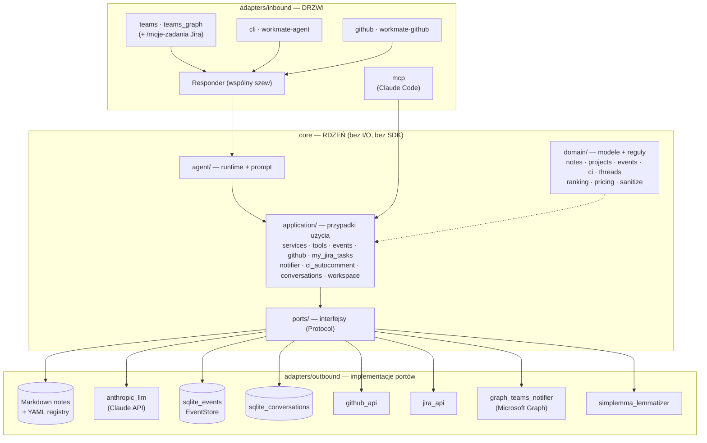

# Architektura: jeden rdzeń, wiele drzwi

## Idea

WorkMate ma jeden „mózg" i wiele „drzwi". **Rdzeń** (`core/`) zawiera całą wartość i całą
trudność: modele danych, logikę wyszukiwania i rankingu, syntezę statusu, runtime agenta,
warstwę zdarzeń i notyfikacji. **Drzwi** (`adapters/`) to cienkie adaptery — kanały, którymi
wchodzi zapytanie i wychodzi odpowiedź. Ponieważ kontrakt rdzenia jest stabilny, dołożenie
kolejnych drzwi (Teams, GitHub, Jira) przestało być decyzją architektoniczną — jest dorobieniem
adaptera nad **tym samym** katalogiem narzędzi.

## Warstwy (heksagonalnie)

- **`core/domain/`** — modele i reguły bez I/O: `Note`, `Project`, `ProjectStatus` i schemat
  notatki (`models.py`), a także `events`, `conversation`, `ci`, `threads`, `workspace`,
  `pricing`, `ranking` (BM25/RRF) i `sanitize`. Zero zależności od frameworków.
- **`core/ports/`** — interfejsy (`Protocol`), których wymaga rdzeń: `repositories`
  (`NotesRepository`, `ProjectsRepository`), `llm`, `conversations`, `events`, `github`,
  `jira` (`JiraReadPort` — TYLKO odczyt: `authenticated_account`, `search_issues`),
  `identity` (`AadIdentityLookup`), `notifications`, `thread_links`, `workspace`, `text`,
  `meeting`. To „gniazda" dla adapterów.
- **`core/application/`** — przypadki użycia zależne wyłącznie od portów: `services`
  (notatki, status, wyszukiwanie), jednoźródłowy katalog narzędzi `tools`, `events`, `github`,
  `my_jira_tasks` (czysty odczyt „moje zadania"), `notifier`, `ci_autocomment`, `conversations`,
  `compaction`, `workspace`, `meeting_notes`.
- **`core/agent/`** — runtime agenta (`runtime.py`) i budowa promptu (`prompt.py`): model Claude
  w pętli, który czyta zapytanie, woła narzędzia i składa odpowiedź.
- **`adapters/inbound/`** — drzwi: `mcp` (serwer MCP), `teams` i `teams_graph` (delegowany
  polling Graph; obsługuje też komendę `/moje-zadania`), `teams_digest` (proaktywny digest
  tygodniowy), `cli`, `github` (polling PAT + notifier). Nie ma już osobnych drzwi `jira` — most
  Teams↔Jira, poller i push zniknęły ([ADR 0054](../adr/0054-reduce-jira-to-read-only-my-tasks.md)).
  Wspólny szew `responder.py` (tu, nie w rdzeniu — oddziela transport od treści odpowiedzi, ale
  sam jest drzwiami, nie logiką bez I/O).
- **`adapters/outbound/`** — implementacje portów: repozytoria Markdown/YAML, `anthropic_llm`
  i `anthropic_summarizer` (Claude API), `github_api`, `jira_api` (`HttpxJiraClient`/
  `HttpxJiraCloudClient`, metody zapisu/tranzycji usunięte), `sqlite_events` /
  `sqlite_conversations` / `sqlite_thread_links`, `graph_teams_notifier`, `simplemma_lemmatizer`,
  `filesystem_workspace`.
- **`server.py`** — **punkt składania**: tworzy adaptery, wstrzykuje je do serwisów, podpina
  serwisy do drzwi. `config.py` — typowana konfiguracja ze zmiennych środowiskowych.

## Reguła zależności (najważniejsza konwencja)

**`core/` nigdy nie importuje z `workmate.adapters`.** Zależność jest jednokierunkowa: adaptery
znają rdzeń, rdzeń nie zna adapterów. Dlatego:

- logikę testujemy na atrapach w pamięci, bez dysku, sieci i SDK;
- podmiana magazynu danych (plik → baza, jeden model LLM → inny) nie dotyka logiki;
- nowe drzwi to nowy pakiet w `adapters/`, a nie przebudowa rdzenia.

## Runtime agenta: te same narzędzia, dwie głębokości wejścia

Claude Code **sam jest agentem** — potrzebuje tylko narzędzi, i do tego służy MCP (drzwi `mcp`
wystawiają katalog wprost). Teams i CLI własnego agenta nie mają, więc dla nich rdzeń
dostarcza **runtime agenta**: model, który prowadzi rozmowę (z pamięcią i kompaktowaniem historii),
woła te same narzędzia i składa odpowiedź. Kluczowe: **katalog narzędzi jest jednoźródłowy**
(`application/tools.py`) — drzwi MCP i runtime agenta dostają je z tego samego miejsca
([ADR 0008](../adr/0008-agent-runtime-and-tool-catalog.md)). Powierzchnia MCP (4+1) jest zamrożona
i pilnowana golden-testem; narzędzia warstwy roboczej i mostu wchodzą per drzwi przez
`extra_catalog`, więc nie ruszają tej powierzchni.

## Most: GitHub ↔ EventStore ↔ Teams

Niezależne procesy spotykają się na jednym pliku SQLite (`EventStore`, append-only z
deduplikacją). Nikt nie woła nikogo bezpośrednio:

- **GitHub → EventStore** — drzwi `github` (`workmate-github`) odpytują repo tokenem PAT i mapują
  białą listą pól zdarzenia issue/PR/komentarzy/recenzji/CI ([ADR 0020](../adr/0020-github-delegated-polling-door.md), [ADR 0024](../adr/0024-github-pr-ci-review-ingest-and-bidirectional-teams-threads.md)).
- **EventStore → Teams** — notifier wypycha zdarzenia na kanał i czat 1:1; wątkowanie dokłada
  zdarzenia jednego issue/PR do wspólnego wątku ([ADR 0022](../adr/0022-proactive-dual-target-teams-push.md)).
- **Teams → GitHub** — agent na kanale, przez bramkowany zapis (create-only), zakłada issue lub
  odpowiada w wątku wprost na powiązanym issue/PR ([ADR 0021](../adr/0021-github-write-capability-gate-4.md), [ADR 0024](../adr/0024-github-pr-ci-review-ingest-and-bidirectional-teams-threads.md)).

Niezawodność stoi na czterech filarach: append-only + dedup `(source, external_id, kind)`,
watermark przesuwany dopiero po ingest (at-least-once), kursor konsumenta przesuwany dopiero po
udanej wysyłce, oraz **dwustronny strażnik pętli** (self-skip zdarzeń autorstwa konta PAT;
echo zapisu oznaczone `source="teams"`, którego notifier nie odsyła). Jedyną autonomiczną
ścieżką zapisu jest deterministyczny (nie-LLM) auto-komentarz przy porażce CI.

## Jira: wyłącznie odczyt „moje zadania" (bez mostu)

Jira **nie** wchodzi wzorcem mostu powyżej — nie ma pollera, nie ma `EventStore`, nie ma pushu do
Teams ani zapisu w żadną stronę ([ADR 0054](../adr/0054-reduce-jira-to-read-only-my-tasks.md),
supersedes [0031](../adr/0031-jira-write-capability-gate-5.md)/[0032](../adr/0032-jira-status-transition-capability.md)).
Jest jedno narzędzie, `get_my_jira_tasks` (`core/application/my_jira_tasks.py`, zero parametrów) —
woła `JiraReadPort.search_issues` synchronicznie, w ramach tej samej tury agenta, i zwraca TYLKO
otwarte zadania przypisane PYTAJĄCEMU. Tożsamość pytającego (nigdy parametr narzędzia) wyznacza
zakres: na drzwiach Teams (komenda `/moje-zadania`, alias `/zadania`) z mapy AAD→Jira
(`WORKMATE_TEAMS_GRAPH_IDENTITIES`, pole `jira_user`); na drzwiach MCP stdio (Claude Code/CLI) z
jednego z góry skonfigurowanego principala (`WORKMATE_JIRA_MY_ACCOUNT`) — dlatego to narzędzie
nie nadaje się na współdzielony serwer HTTP z wieloma osobami, tylko na lokalne stdio jednej osoby.

## Retrieval leksykalny

Wyszukiwanie notatek (`search_notes`) korzysta z rankingu BM25 nad lematami (polska lematyzacja
`simplemma` przez port `Lemmatizer`), z **fallbackiem podłańcuchowym**, gdy brak extra `retrieval`
— import jest leniwy, więc serwer i testy bez tego extra działają bez zmian. Jakość rankingu
pilnuje mikro-eval nad zestawem złotych zapytań ([ADR 0023](../adr/0023-hybrid-local-retrieval.md)).

## Granice zaufania

Źródła prawdy zostają źródłami prawdy: rejestr projektów i notatki to dane, których rdzeń nie
zastępuje, tylko **syntetyzuje** (np. status projektu = część zadeklarowana z rejestru + fakty
policzone z notatek). Treść notatek, zdarzeń GitHub, zadań Jira i wiadomości z Teams jest zawsze
traktowana jak **dane, nigdy jak polecenia**. Zapis idzie wyłącznie przez wąskie, bramkowane narzędzia
(profil uprawnień per drzwi — mniej zaufane drzwi mają mocniejsze bramkowanie), a sekrety żyją
poza rdzeniem, czytane z env/plików spoza `data/`.
